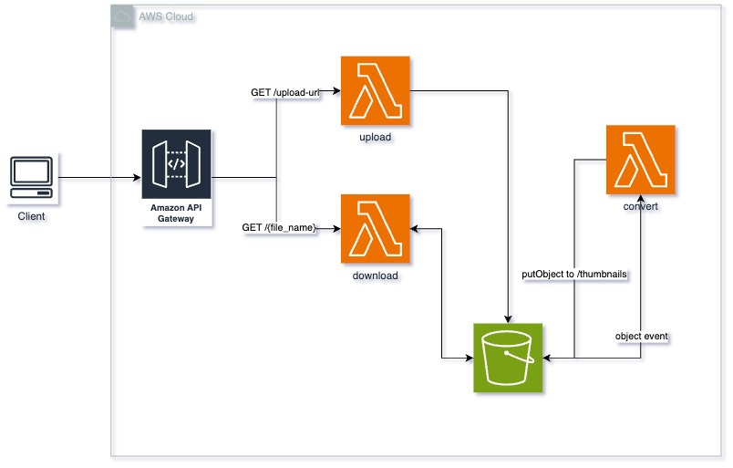

# Serverless Framework Python HTTP API Image Converter on AWS

This repository contains a simple Python HTTP API application that uses the Serverless Framework to deploy to AWS.

It provides 2 endpoints:
- GET `/upload-url` - returns a pre-signed URL to upload an image to S3
- GET `/{file_name}` - downloads the image from S3 and returns it

It also contains an S3 object creation event that triggers a Lambda function to convert the image to a thumbnail.

## Architecture



## Deployment

```bash
# Install all necessary dependencies
npm install

# Deploy the application
npx serverless deploy
```

After deploying, you should see output similar to:

```bash
Deploying aws-python-image-converter to stage dev (us-east-1)

✔ Service deployed to stack aws-python-image-converter-dev (140s)

endpoint: GET - https://xxxxxxxxxx.execute-api.us-east-1.amazonaws.com/
functions:
  download: aws-python-image-converter-dev-download (2.3 kB)
  ...
```

### Invocation

After successful deployment, you can call the created application via HTTP:

```bash
curl https://xxxxxxx.execute-api.us-east-1.amazonaws.com/
```

Which should result in response similar to the following (removed `input` content for brevity):

```json
{
  "message": "Go Serverless v3.0! Your function executed successfully!",
  "input": {
    ...
  }
}
```

### Local development

You can invoke your function locally by using the following command:

```bash
serverless invoke local --function hello
```

Which should result in response similar to the following:

```
{
  "statusCode": 200,
  "body": "{\n  \"message\": \"Go Serverless v3.0! Your function executed successfully!\",\n  \"input\": \"\"\n}"
}
```

You can start local API Gateway emulation with:

```
serverless offline
```

To learn more about the capabilities of `serverless-offline`, please refer to its [GitHub repository](https://github.com/dherault/serverless-offline).